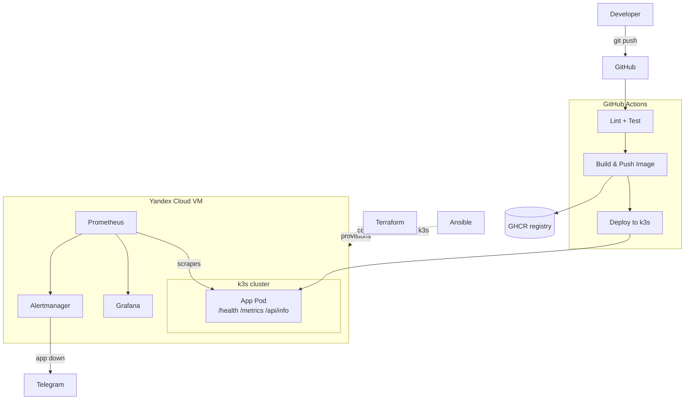

# Zero to Prod

A small DevOps portfolio project: take an empty cloud VM all the way to a running,
monitored application using IaC, configuration management, Kubernetes, CI/CD and
observability.

## Architecture



## Repo structure

| Path                  | Purpose                                          |
|-----------------------|---------------------------------------------------|
| `/app`                | FastAPI demo app + Dockerfile                    |
| `/terraform`          | IaC for the Yandex Cloud VM, network, security group |
| `/ansible`            | VM configuration: Docker, k3s, firewall (Phase 2) |
| `/k8s`                | Kubernetes manifests (Phase 3)                   |
| `/.github/workflows`  | CI/CD pipelines (Phase 4)                        |
| `/monitoring`         | Prometheus/Grafana/Alertmanager setup (Phase 5)  |
| `/docs`               | Additional documentation                         |

## Status

- [x] **Phase 1** - Demo app + Terraform skeleton
- [ ] Phase 2 - Ansible provisioning (Docker, k3s, firewall)
- [ ] Phase 3 - Kubernetes manifests + manual deploy
- [ ] Phase 4 - CI/CD via GitHub Actions
- [ ] Phase 5 - Monitoring (Prometheus, Grafana, Alertmanager -> Telegram)
- [ ] Phase 6 - Final docs polish

## App

A minimal FastAPI app exposing:

- `GET /health` - liveness/readiness check, returns `{"status": "ok"}`
- `GET /metrics` - Prometheus metrics (`http_requests_total`, `http_request_duration_seconds`)
- `GET /api/info` - hostname, platform, Python version, process uptime

### Run locally

```bash
cd app
python -m venv .venv
source .venv/bin/activate   # Windows: .venv\Scripts\activate
pip install -r requirements-dev.txt
uvicorn main:app --reload
```

Then check `http://localhost:8000/health`, `/metrics`, `/api/info`.

### Run tests

```bash
cd app
pytest
```

### Run with Docker

```bash
cd app
docker build -t zero-to-prod-app .
docker run -p 8000:8000 zero-to-prod-app
```

## Infrastructure (Terraform)

Provisions a single Ubuntu 22.04 VM on Yandex Cloud, along with a VPC network,
subnet and a security group opening ports `22` (SSH), `80`/`443` (HTTP/HTTPS) and
`6443` (k3s API).

### Set up Yandex Cloud auth (run locally, not in this repo)

```bash
# one-time: install and configure the yc CLI
# https://yandex.cloud/en/docs/cli/quickstart
yc init

# find your cloud_id and folder_id
yc config list

# get a short-lived auth token for Terraform (re-run when it expires)
export YC_TOKEN=$(yc iam create-token)
```

### Apply

```bash
cd terraform
cp terraform.tfvars.example terraform.tfvars
# edit terraform.tfvars: set cloud_id, folder_id, ssh_public_key_path, etc.

terraform init
terraform plan
terraform apply
```

`terraform.tfvars` and `*.tfstate` are gitignored - never commit them.

## What's next

Phase 2: an Ansible playbook to take the fresh VM from `terraform apply` to a
ready k3s node (updates, firewall, Docker, k3s install).
