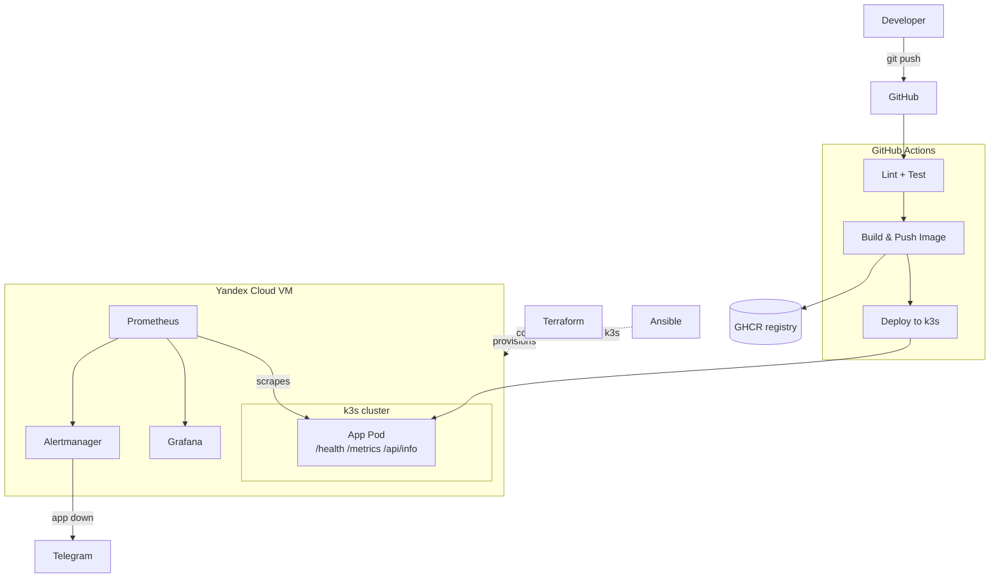

# Zero to Prod

[](https://github.com/flexxrap/zero-to-prod/actions/workflows/ci-cd.yml)


A small DevOps portfolio project: take an empty cloud VM all the way to a running,
monitored application using IaC, configuration management, Kubernetes, CI/CD and
observability.

## Quick start: zero to prod

1. **Provision the VM** - Terraform creates a Yandex Cloud VM, network and
   security group. See [Infrastructure](#infrastructure-terraform).
2. **Configure the VM** - Ansible installs Docker and k3s, and sets up the
   firewall and swap. See [Configuration](#configuration-ansible).
3. **Deploy the app** - apply the manifests in `/k8s` with `kubectl`. See
   [Kubernetes manifests](#kubernetes-manifests).
4. **Wire up CI/CD** - pushes to `master` lint, test, build, push to GHCR and
   deploy automatically. See [CI/CD](#cicd).
5. **Add monitoring** - install `kube-prometheus-stack` and get a Telegram
   alert if the app goes down. See [Monitoring](#monitoring).

## Architecture



## Repo structure

| Path                  | Purpose                                          |
|-----------------------|---------------------------------------------------|
| `/app`                | FastAPI demo app + Dockerfile                    |
| `/terraform`          | IaC for the Yandex Cloud VM, network, security group |
| `/ansible`            | VM configuration: Docker, k3s, firewall          |
| `/k8s`                | Kubernetes manifests for the app                 |
| `/.github/workflows`  | CI/CD pipeline                                   |
| `/monitoring`         | Prometheus/Grafana/Alertmanager setup            |
| `/docs`               | Additional documentation                         |

## Status

- [x] **Phase 1** - Demo app + Terraform skeleton
- [x] **Phase 2** - Ansible provisioning (Docker, k3s, firewall)
- [x] **Phase 3** - Kubernetes manifests + manual deploy
- [x] **Phase 4** - CI/CD via GitHub Actions
- [x] **Phase 5** - Monitoring (Prometheus, Grafana, Alertmanager -> Telegram)
- [x] **Phase 6** - Final docs polish

## App

A minimal FastAPI app exposing:

- `GET /health` - liveness/readiness check, returns `{"status": "ok"}`
- `GET /metrics` - Prometheus metrics (`http_requests_total`, `http_request_duration_seconds`)
- `GET /api/info` - hostname, platform, Python version, process uptime

### Run locally

```bash
cd app
python -m venv .venv
source .venv/bin/activate   # Windows: .venv\Scripts\activate
pip install -r requirements-dev.txt
uvicorn main:app --reload
```

Then check `http://localhost:8000/health`, `/metrics`, `/api/info`.

### Run tests

```bash
cd app
pytest
```

### Run with Docker

```bash
cd app
docker build -t zero-to-prod-app .
docker run -p 8000:8000 zero-to-prod-app
```

## Infrastructure (Terraform)

Provisions a single Ubuntu 22.04 VM on Yandex Cloud, along with a VPC network,
subnet and a security group opening ports `22` (SSH), `80`/`443` (HTTP/HTTPS) and
`6443` (k3s API).

### Set up Yandex Cloud auth (run locally, not in this repo)

```bash
# one-time: install and configure the yc CLI
# https://yandex.cloud/en/docs/cli/quickstart
yc init

# find your cloud_id and folder_id
yc config list

# get a short-lived auth token for Terraform (re-run when it expires)
export YC_TOKEN=$(yc iam create-token)
```

### Apply

```bash
cd terraform
cp terraform.tfvars.example terraform.tfvars
# edit terraform.tfvars: set cloud_id, folder_id, ssh_public_key_path, etc.

terraform init
terraform plan
terraform apply
```

`terraform.tfvars` and `*.tfstate` are gitignored - never commit them.

## Configuration (Ansible)

Takes the fresh VM from `terraform apply` to a ready k3s node:

- `base` role - apt updates, base packages, ufw firewall (22/80/443/6443, deny
  the rest), 1 GB swap file, an unprivileged `deploy` user with sudo and your
  SSH key
- `docker` role - installs Docker CE from the official repo, adds `deploy` to
  the `docker` group
- `k3s` role - installs k3s via the official install script

### Run

```bash
cd ansible
ansible-galaxy collection install -r requirements.yml

cp inventory.example.ini inventory.ini
# edit inventory.ini: set ansible_host to terraform's vm_external_ip output

ansible-playbook playbook.yml
```

`inventory.ini` is gitignored - never commit it.

### Accessing the k3s cluster

```bash
scp ubuntu@VM_IP:/etc/rancher/k3s/k3s.yaml ./kubeconfig
# edit kubeconfig: replace 127.0.0.1 with VM_IP
export KUBECONFIG=$(pwd)/kubeconfig
kubectl get nodes
```

`kubeconfig*` is gitignored - never commit it.

## Kubernetes manifests

`/k8s` contains:

- `deployment.yaml` - 2 replicas, CPU/memory requests and limits,
  liveness/readiness probes on `/health`
- `service.yaml` - ClusterIP service exposing the app on port 80
- `ingress.yaml` - routes `/` to the service via k3s's built-in Traefik

### Manual deployment

The CI/CD pipeline (see [CI/CD](#cicd)) builds and deploys the image
automatically on every push to `master`. For a first deploy, or to test
without CI, build and load the image on the VM directly:

```bash
# on the VM, with the app/ directory copied over
cd app
docker build -t ghcr.io/flexxrap/zero-to-prod-app:latest .

# load the image into k3s's containerd so it doesn't try to pull from GHCR
docker save ghcr.io/flexxrap/zero-to-prod-app:latest | sudo k3s ctr images import -
```

Then apply the manifests from your local machine (using the kubeconfig from
the previous section) or directly on the VM:

```bash
kubectl apply -f k8s/

kubectl get pods
kubectl get svc
curl http://VM_IP/health
curl http://VM_IP/api/info
```

## CI/CD

On every push and pull request to `master`:

- lint the app with `ruff`
- run `pytest`

On push to `master` only, after lint/test pass:

- build the Docker image and push it to `ghcr.io/flexxrap/zero-to-prod-app`
  (tagged `latest` and with the commit SHA)
- apply `k8s/` and roll out the new image to the k3s cluster via `kubectl`

GHCR push uses the built-in `GITHUB_TOKEN`, no extra setup needed.

### One-time setup (run locally, not in this repo)

The deploy job needs a `KUBE_CONFIG` secret - a base64-encoded kubeconfig
pointing at the VM's public IP (see "Accessing the k3s cluster" above):

```bash
base64 -w0 kubeconfig | gh secret set KUBE_CONFIG --repo flexxrap/zero-to-prod
```

## Monitoring

`/monitoring` holds the `kube-prometheus-stack` (Prometheus + Grafana +
Alertmanager) config, plus a `ServiceMonitor`/`PrometheusRule` for the app and
a Grafana dashboard.

- `values.yaml` - Helm values tuned for a small single-node VM (low resource
  requests, 1-day retention, cluster-wide ServiceMonitor/Rule selectors)
- `values.secret.yaml.example` - Telegram Alertmanager receiver, copy to
  `values.secret.yaml` (gitignored) and fill in your chat ID
- `service-monitor.yaml` - scrapes `/metrics` on the app's Service every 15s
- `alert-rules.yaml` - `AppDown` alert if `up == 0` for more than 1 minute
- `dashboards/zero-to-prod-app.json` - request rate, p95 latency, node CPU
  and memory

### Install

```bash
helm repo add prometheus-community https://prometheus-community.github.io/helm-charts
helm repo update

kubectl create namespace monitoring

# Telegram bot token, mounted into Alertmanager as a file - never goes into git
kubectl create secret generic telegram-bot-token \
  --from-literal=token=<YOUR_BOT_TOKEN> \
  -n monitoring

cp monitoring/values.secret.yaml.example monitoring/values.secret.yaml
# edit values.secret.yaml: set your Telegram chat_id

helm install kube-prometheus-stack prometheus-community/kube-prometheus-stack \
  -n monitoring \
  -f monitoring/values.yaml \
  -f monitoring/values.secret.yaml

kubectl apply -f monitoring/service-monitor.yaml
kubectl apply -f monitoring/alert-rules.yaml

kubectl create configmap zero-to-prod-dashboard \
  --from-file=monitoring/dashboards/zero-to-prod-app.json \
  -n monitoring
kubectl label configmap zero-to-prod-dashboard grafana_dashboard=1 -n monitoring
```

`monitoring/values.secret.yaml` is gitignored - never commit it.

### Open Grafana

```bash
kubectl port-forward -n monitoring svc/kube-prometheus-stack-grafana 3000:80

# default user is admin, password:
kubectl get secret kube-prometheus-stack-grafana -n monitoring \
  -o jsonpath="{.data.admin-password}" | base64 -d
```

Open `http://localhost:3000` and find the "Zero to Prod - App & Cluster" dashboard.

_TODO: add a screenshot of the dashboard here once the stack is running._

## What I'd improve next

- **HTTPS** - cert-manager + Let's Encrypt on the Ingress instead of plain HTTP
- **HA** - a multi-node k3s cluster instead of a single VM as a single point
  of failure
- **GitOps** - replace the `kubectl apply` deploy step with Argo CD or Flux
  watching `/k8s`
- **Secrets management** - Sealed Secrets or Vault instead of manually
  created Kubernetes secrets
- **Persistent storage** - Prometheus currently uses `emptyDir`; add a PVC so
  metrics survive pod restarts
- **Autoscaling** - a HorizontalPodAutoscaler for the app based on CPU or
  request rate
- **Staging environment** - deploy PRs to a separate namespace before merging
  to `master`

## Contributing

See [CONTRIBUTING.md](CONTRIBUTING.md).

## License

[MIT](LICENSE)
